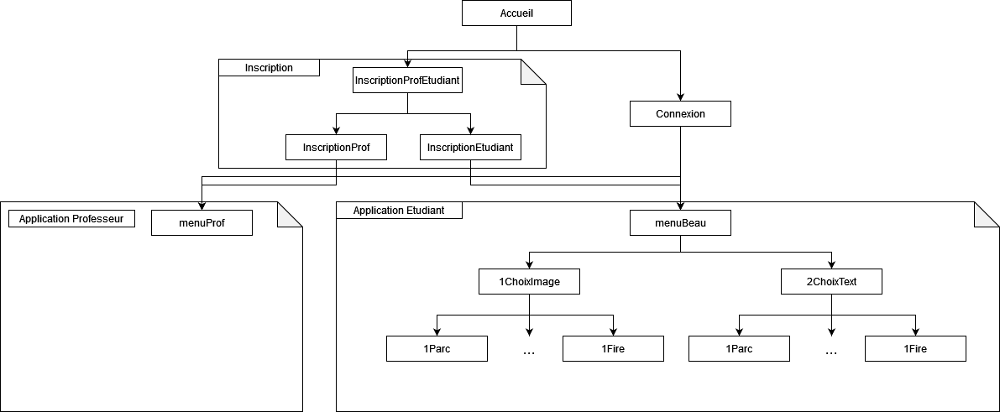

# Serious-Language-Game-CODEV33

Projet étudiant IMT Atlantique : Serious Language Game 

Etudiants : Ellyas Dago, Léa Miqueu, Antoine Sarignac

Ce projet a pour objectif de créer une application web permettant l'apprentissage d'une langue étrangère via l'enregistrement d'exercices comme la description d'images ou la lecture d'un texte. L'application met en place deux types d'utilisateurs : les étudiants et les professeurs. Les étudiants ont accès aux différents jeux proposés par l'application tandis que les professeurs ont l'opportunité de commenter les audios des élèves et de voir les commentaires des autres professeurs sur ce même audio. 

L'architecture de l'application web est présente ci-dessous avec le nom des codes correspondant aux pages web: 

Dans le serveur est mis en place une base de données, dont les requêtes de création se trouvent dans bd_V2.sq et l'architecture est fournie ci-dessous : 

.jpg)

